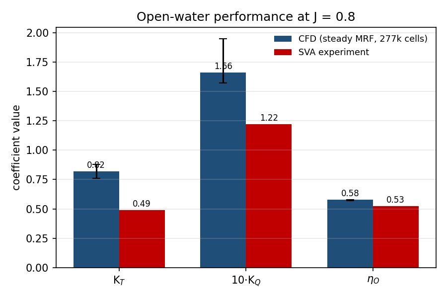
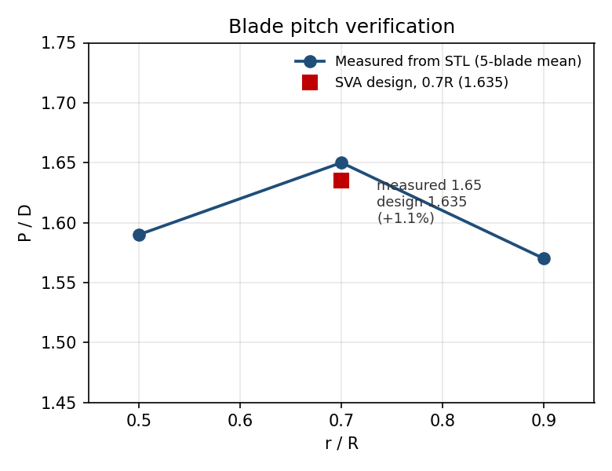
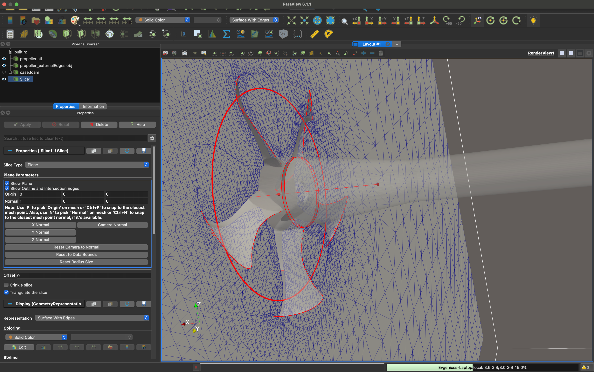
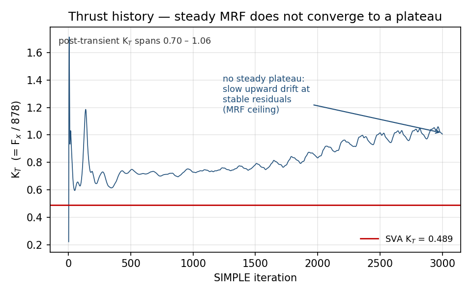
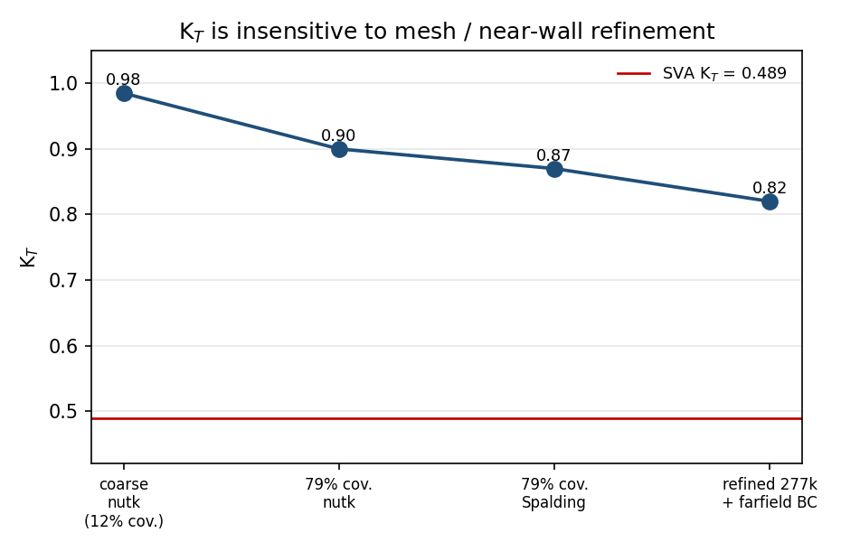

# Open-Water CFD of the PPTC VP1304 Propeller

A validated open-water CFD study of the SVA Potsdam **PPTC VP1304** controllable-pitch propeller, run entirely on a laptop (MacBook M2, 8 GB RAM) in OpenFOAM. The focus is not a single headline number but a documented, evidence-based investigation of where a residual thrust error comes from, and of the point at which the hardware and the steady-MRF method run out of road.

**Operating point:** J = 0.8, U = 3 m/s, n = 15 rev/s, D = 0.25 m.
**Benchmark:** SVA Potsdam open-water data (K_T = 0.489, K_Q = 0.122, η_O = 0.525).

Full write-up: [`propeller/PPTC_VP1304_CFD_report.md`](propeller/PPTC_VP1304_CFD_report.md)

**At a glance:**
- Steady RANS in OpenFOAM (`simpleFoam`, k-ω SST, MRF frozen-rotor)
- Validation against SVA Potsdam open-water experimental data
- Custom Python tooling for geometry verification and figure generation
- Systematic mesh, near-wall, and boundary-condition sensitivity study
- Honest treatment of hardware and method limits, not just a headline number

---

## Headline result

The steady frozen-rotor MRF solution reproduces the propeller's **efficiency** almost exactly (η_O ≈ 0.58 vs 0.525) but **overpredicts the loading** by roughly 1.5–2× (post-transient K_T ≈ 0.7–1.0 vs 0.489). Because the efficiency (the thrust-to-torque ratio) is correct while both forces are too large, the error is one of loading *magnitude*, not of flow *kinematics*. That single observation drives the whole investigation.



---

## What was done

1. **Geometry check.** The blade pitch was measured directly from the STL rather than assumed, using a small principal-axis tool validated on a synthetic propeller of known pitch. Result: P/D = 1.65 at 0.7R against the design 1.635 (+1.1 %), all five blades identical. The geometry is at design pitch.

   

2. **Meshing.** `blockMesh` background with `snappyHexMesh` (feature capture, surface refinement, three prism layers). Prism-layer coverage was raised from 12 % to 79 %; final mesh 277 k cells. The cell count was kept deliberately within what 8 GB can solve comfortably rather than pushed to the limit.

   

   *Slice through the blade disc showing the localised refinement: a cylinder around the propeller at level 3, the blade surface at 3–4, and the trailing edges at level 4, with the background size everywhere else. At least three cells of equal size sit between levels so transitions are gradual. Shown at the castellation-and-snapping stage with layers switched off (216 k cells); the final mesh with tip refinement and layers reaches 277 k.*

3. **Solve.** Incompressible RANS, k-ω SST, MRF frozen-rotor, `simpleFoam`. A cylindrical zone enclosing the blades rotates at the propeller speed while the outer domain stays stationary; the blades, hub and shaft are a single no-slip patch. Forces and moments are integrated over that patch.

4. **Error investigation.** Five candidate causes of the overprediction were tested and each eliminated or bounded (see table below).

---

## The convergence finding

The thrust never reaches a plateau. After the transient, K_T drifts slowly upward at **stable residuals**, which is the direct signature of a steady frozen-rotor method being asked to hold an inherently unsteady wake. This is not a bug to fix; it is the method's ceiling on this case, and it is why coefficients are reported as spans.



---

## Systematic exclusion

| # | Hypothesis | Test | Verdict |
|---|---|---|---|
| 1 | Near-wall treatment | coverage 12 % → 79 %; Spalding wall function | Not the driver (thrust is pressure-dominated) |
| 2 | Blade surface resolution | refinement level 4 → 5 | Not the driver (mesh-converged in range) |
| 3 | Far-field blockage | slip → pressure-opening BC | Not the driver (~3 %) |
| 4 | Blade pitch fidelity | direct P/D measurement | Geometry correct (1.65 vs 1.635) |
| 5 | Hub / shaft thrust | physical bound | Bounded to ≤ 10–15 % |

Every mesh and near-wall intervention left K_T far above the experiment, confirming the offset is not a discretisation artefact:



The residual is attributed to an under-resolved tip vortex (which would need on the order of 10⁷ cells, well beyond 8 GB) and the intrinsic ceiling of steady MRF for a heavily loaded propeller. Reaching the measured 0.489 would require a transient sliding-mesh run on cloud/HPC hardware, listed as future work.

---

## Repository layout

```
propeller/                     OpenFOAM case
  0.orig/                      clean initial fields
  constant/                    transport + turbulence properties
  system/                      blockMesh, snappyHexMesh, controlDict, fvSolution
  figures/                     Python scripts that generate the figures
  pitch_verify.py              standalone STL pitch-measurement tool
  PPTC_VP1304_CFD_report.md    full technical report
learning/                      earlier practice cases
scripts/                       helper scripts
```

Heavy and regenerated files (mesh, time directories, geometry binaries, logs) are excluded via `.gitignore`; the raw force and moment data under `postProcessing/` are kept so the figures reproduce.

---

## Reproducing the figures

From inside `propeller/`:

```bash
pip3 install matplotlib numpy

python3 figures/fig1_pitch.py
python3 figures/fig2_convergence.py postProcessing/forces/0/force.dat
python3 figures/fig3_openwater.py
python3 figures/fig4_campaign.py
```

`fig2_convergence.py` reads the raw solver output directly; the others are driven by the measured values reported in the study. The pitch tool runs standalone:

```bash
python3 pitch_verify.py constant/triSurface/propeller.stl
```

---

## Tools

OpenFOAM v2606 · ParaView 6.1.1 · Python (matplotlib, numpy) · FreeCAD (headless STEP-to-STL conversion) · macOS, MacBook M2, 8 GB RAM.

## Data and licensing

Geometry and reference data from SVA Potsdam (PPTC VP1304, Report 3752) and the SMP'11 workshop, used with attribution. Code in this repository is under the terms in [`LICENSE`](LICENSE).
